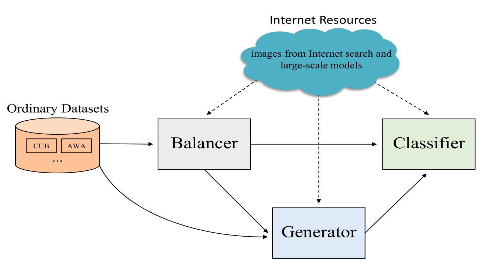
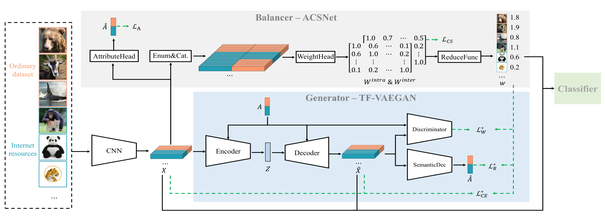

# BGF-MSL

## Introduce

This repository contains the official PyTorch implementation of "BGF-MSL: Balanced Generative Framework for Meta-Shot Learning".

In the paper, we define a new realistic cognitive paradigm, named Meta-Shot Learning, in which the learner could utilize plentiful online Internet Resources to construct its recognition and reasoning ability quickly. At the same time, learners can engage in learning new classes even in situations of limited internet resources or even in offline settings.

The Balanced Generative Framework (BGF) is proposed for Meta-Shot Learning, named BGF-MSL, specifically including three modules: Balancer keeps its training results as image weights to eliminate data imbalance among different classes; Generator generates pseudo features under the guidance of weights; Classifier trained with the balanced original and pseudo features completes the classification.



The code in this repository presents the optimal implementation of BGF-MSL, i.e., our method, selected by Meta-Shot Learning experiments and ablation studies from several implementations. The specific model structure is shown in the following figure.



## Data

We release the training web images of CUB, FLO, SUN, AWA2 and APY at [Baidu Cloud](https://pan.baidu.com/s/1TXXqBjp3COd-d6X_7iBSxg) (access code: xjha) to support future comparison and analysis in Meta-Shot Learning research. The files in `./dataset` is as follows:

```angular2html
├── APY
  ├── APY_web
      ├── aeroplane
        ├── ……
      ├── ……
  ├── mat
      ├── APY_source_features.mat
      ├── APY_web_features.mat
      ├── att_splits.mat
  ├── meta
      ├── testclasses.txt
      ├── trainclasses.txt
  ├── origin
      ├── ayahoo_test_images
          ├── ……
      ├── images_att
          ├── VOCdevkit
              ├── ……
      ├── classes.txt
      ├── images.txt
      ├── predicate-matrix-continuous.txt
├── AWA2
├── CUB
├── FLO
```

## Install

Install dependencies using pip: `pip install -r requirements.txt`.

The proposed implementation is implemented in Python 3.10.9 and Pytorch 2.0.0, on Ubuntu 18.04 with an NVIDIA 3090 GPU.

## Train and Evaluate

Training consists of three stages:

1. Training ACSNet (Balancer)
```angular2html
python BGF-MSL/train_ACSNet.py \
--beta 0. \
--lr 5e-3 \
--domain_lr 5e-3 \
--batch_size 50 \
--lr_interval 25 \
--num_epoch 50 \
--head_type 4 \
--batch_class_num_B 2 \
--dim_att 64 \
--path_att_txt dataset/APY/origin/predicate-matrix-continuous.txt \
--data_path dataset/APY \
--cos_sim
```
2. Deriving weights
```angular2html
python ad_similarity/GAN_noise_detection.py \
--data_path dataset/APY \
--save_dir saves/APY_google \
--similarity_net saves/FolderOfACSNetTrainingResult/best.pth
```
3. Training of TF-VAEGAN (Generator) and Classifier is conducted, followed by evaluation.
```angular2html
python TFVAEGAN/train_images.py \
-dataset APY \
-strategy cosine_inter_expo3 \
-seen_weight_alpha_classifier 2 \
-aux_to_vae \
-n_aux_per_class 200 \
-web_weight_e 3.0
```
